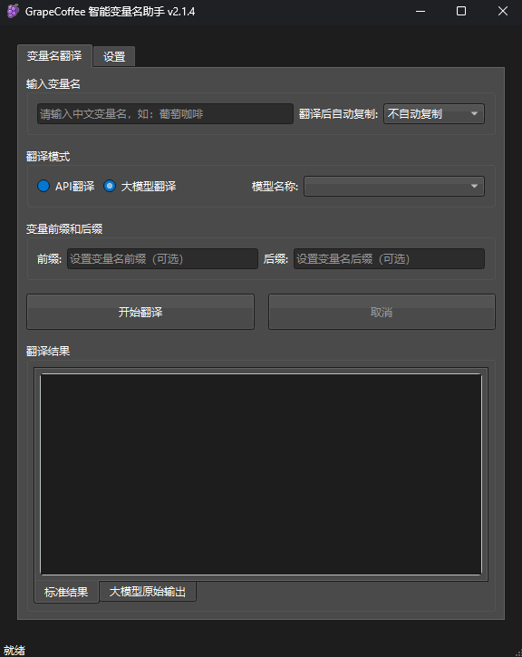

<p align="center"><a href="https://github.com/JAINKRE/GrapeCoffee"></a></p>
<p align="center"><b>GrapeCoffee 智能变量名助手</b></p>

---

GrapeCoffee 是一款基于 Ollama 服务的智能变量命名工具，能够将中文变量名自动翻译为英文，并解析为多种常见的命名规则。

界面简洁、操作便捷，支持快捷键快速复制，可显著提升大家的开发效率：

<p align="center"><a href="https://github.com/JAINKRE/GrapeCoffee"></a></p>


## 下载安装

你可以在 [Release](https://github.com/JAINKRE/GrapeCoffee/releases) 下载最新版本的安装包，目前仅提供 Windows 版本。

GrapeCoffee 基于 Python 3.12 和 PySide6 开发，本身具备良好的跨平台支持。若不想通过安装包安装，可下载源码后使用 PyInstaller 自行打包为单文件版本或支持你系统环境的版本。


## 输入变量名

输入中文变量名，点击`开始翻译`或`回车`将自动根据选择的翻译模型生成变量名。

多数情况下可能需要的变量名类型是固定的，此时你可以在`翻译后自动复制`下拉框中选择对应的变量名类型，翻译完成后将自动复制到剪切板中，使用`ctrl+v`即可黏贴。


## 翻译模式

支持`APi翻译`和`大模型翻译`，推荐使用大模型翻译。

### 大模型翻译

当第一次使用时，需要在本地环境中搭建ollama或者使用已有的ollama服务。点击应用的`设置`，在`模型地址`输入框输入你的ollama服务地址，格式如下：

```txt
http://192.168.3.88:11434
```

然后，点击`刷新模型列表`，如果ollama服务地址正确且可用，点击后将在`模型名称`下拉框中看到ollama中所有安装的模型。

返回`变量名翻译`，在`模型名称`中可下拉选择需要使用的模型名称，支持滚轮滚动快捷选择。

> 注意：如果下次启动想直接使用当前选择的模型名称，请点击`保存设置`按钮，或使用快捷键`ctrl+s` (快捷键已启用)。


### 翻译 API（可选）

如未部署 Ollama，也可使用百度翻译 API：`https://api.fanyi.baidu.com`。申请免费 API，将获取的 `API ID` 和 `密钥` 填入设置中即可使用

目前只支持百度翻译API，其他翻译API均不支持。

> 建议：百度翻译API作为备份方案，实测翻译API效果在变量名转换场景时效果并不理想，只是机械的单词翻译。


## 变量前后缀设置

你可以在`变量前缀和后缀`中分别设置自定义前后缀，默认为空。


## Ollama 大模型设置

在设置中填写 Ollama `模型地址`，点击 `刷新模型列表` 将自动检测服务是否可用，若可用将自动加载 Ollama 中全部模型。

模型`温度参数`推荐保持默认值 `0.0`

`请求超时`默认60秒即可，若你的本地Ollama响应服务过慢，可适当增大请求超时数值

`流水输出`推荐启用，若启用将在`大模型原始输出`tab中流式输出模型响应


#### 支持的模型

当前支持解析 `think` 与非 `think` 类型的模型输出。

只要模型能按提示词规范生成结果，理论上可适配各类模型。


## 提示词模板

建议使用默认提示词模板：

```txt
You are a professional software variable name assistant integrated into the program as part of an API. Your task is to accurately translate the provided Chinese variable name: `{translate_word}` into the corresponding English variable name. The translated variable name should be in lowercase with words separated by spaces. Ensure that the output contains only lowercase letters and spaces, with no other characters or symbols. Output only the translated result, without any additional content.
```

注意：提示词必须包含：

```txt
`{translate_word}`
```

该变量将传递输入的中文变量名给大模型。


## 快捷键

你可以在应用内使用快捷键：

* `ctrl+s`：保存设置。应用内`设置`中全部修改和`变量名翻译`中`翻译后自动复制`和`模型名称`均需要点击`保存设置`按钮才会在下次启动时自动加载对应修改。
* `ctrl+alt+数字键`：复制对应序号的变量名。


## 主题设置

支持多种主题，可下拉选择。

注意，这只是主题变更，UI界面的`暗色`和`亮色`自动跟随系统主题切换。


## 窗口设置

支持`窗口置顶`和`关闭时最小化到托盘`功能


## 更新设置

勾选`自动更新`将在每次启动时自动检测更新，当然，你也可以手动点击`检测更新`按钮更新


## 赞赏支持

项目本身是开源且免费无偿使用的，如果对您有帮助，欢迎赞赏支持☺️


## 许可证

本项目采用 GNU GENERAL PUBLIC LICENSE Version 2 许可证。


## 其他

为什么叫 GrapeCoffe？

因为我正在喝某雪冰城的葡萄冰美式 ☕️。

为什么版本号从 2.1.2 开始？

是因为该项目原为内部工具，经整理后公开发布，免费供大家使用。


---

最后，欢迎给个 ⭐️ 支持一下！
